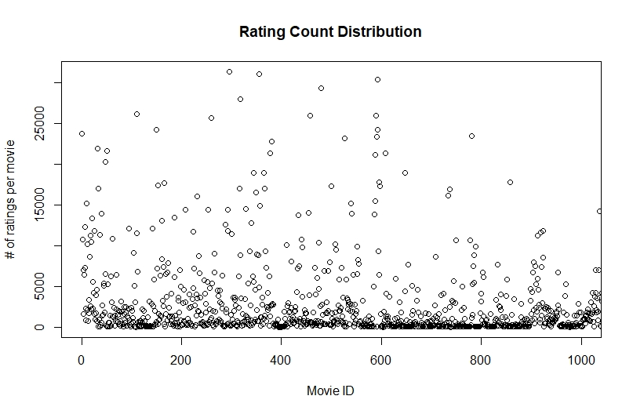
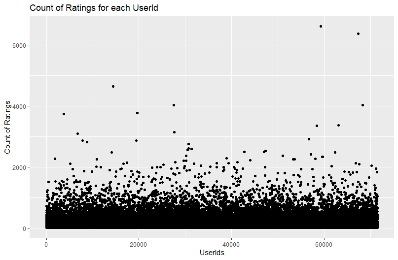
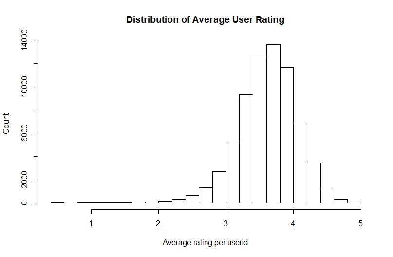

```{r setup, include=FALSE}
knitr::opts_chunk$set(echo = TRUE)
```

## Introduction

The goal of this project is to train a machine learning algorithm using the inputs in a test subset to predict movie ratings in a validation set while minimizing the Root Mean Squared Error or RMSE.

Minimizing the RMSE results in a more accurate prediction. This is achieved through identifying factors which cause bias in the data and accounting for them in the predictions. An RMSE of 1 means that on average, predictions will be 1 star off from the true rating. The closer the RMSE is to 0, the better. 

**Data**

The data is taken from the MovieLens Dataset which contains 10 million movie ratings. The dataset contains 10,000 movies and 72,000 users. The source data can be found here:

[Movielens 10M Database](http://files.grouplens.org/datasets/movielens/ml-10m.zip)

In order to predict and validate the algorythm, the data was split into 10% (training) and 90% (validation) sets for a total of 100%. The training set was used to train the algorythm while the validation set was only used to validate the predictions.

**Steps**

The key steps to complete the project consisted of:

* Data Import 
* Data Exploration
* Data Validation
* Prediction
* Algorythm Comparison
* Algorythm Selection
* Data comparison
* Report Generation

## Analysis

**Data Validation**

I looked for any NA rows across all columns.
>apply(edx, 2, function(x) any(is.na(x)))

None were found

**Data Exploration**

The training set (known as Edx) represents 10% of the movielens database. The focus is upon ratings, which are provided by users for a movie and consist of a number between .5 and 5 with 5 being the highest rating. A user can only provide one rating per movie. The average rating is 3.5.

*Columns of Data: 6 (userId, movieId, rating, timestamp, title, genres)
*Rows of Data: 9000055
*mean rating/mu: | 3.512465
*standard deviation of rating: | 1.06
*Naive RMSE: | 1.060331
*userId: | Number between 1-71567 (User Count 69878)
*movieId: | Number between 1-65133 (Movie Count 10677)
*rating: | number between .5-5
*timestamp: | number representing epoch time
*title: | character string
*genres: | character string

To understand what drives a rating, we must look at factors which may affect it. Below is a histogram of ratings. We can see that ratings appear to skew to towards the right and higher of the mode of 3. This was shown clearly by the mean at 3.5. The ratings are also not evenly distributed. 

``` {r echo=FALSE}
#Load data from script save in order to utilize objects.
load("MovieLens-Esensten.RData")
library(knitr)
library(ggplot2)

```

**Ratings**

A count of the ratings shows far more whole number ratings than half-number. It also shows that ratings of 3, 4, and 5 are the most common.

```{r echo=FALSE}
barplot(table(movie_ratings),xlab="Rating", ylab="Count", main="Distribution of Ratings")
```


Some movies are also rated more times than others. The plot below shows this clearly. Most movies are rated < 2500 times. But some are clearly rated over that and up to 30000 times. The chart below does not show all movieIds, but is a representative sample based upon the first 1000 movies in the set.

<p>

<!-- plot(as.vector(movie_num_ratings), xlab="Movie ID", ylab="# of ratings per movie", main="Rating Count Distribution", xlim=c(0,1000)) -->
</p>

Some movies are also rated higher than others. This could be due to many factors - age of the movie, actor popularity, etc. The following graph shows a sample of movie average ratings. While the average does hover aroung 3.5, there is clearly a distribution from the mean equaling the sd of 1.06.

```{r echo=FALSE}
plot(movies, xlim=c(0,1000), ylab="Movie Avg Rating", main="Average Ratings per MovieId")

```


**Users**

The following plot shows some users rated movies much more than others. The average number of ratings per user was 128 while a small group of users rated movies over 6000 times.

<p>

<!-- qplot(ucr$userId,ucr$n,xlab="UserIds", ylab="Count of Ratings",main="Count of Ratings for each UserId") -->
</p>

User ratings were also varied per user. The histogram below shows that user average ratings where distributed around the mean, but did vary, especially towards the negative.

<p>

<!-- hist(as.vector(user_avg[['x']]), xlab="Average rating per userId", ylab="Count", main="Distribution of Average User Rating") -->
</p>

**Genres**

There are 19 Genres which movies are tagged with. An individual movie may have more than one genre. 
```{r echo=FALSE}
kable(sort(genre_count), caption="Count of Genre Tags")

```

**Prediction**

There are two clear biases that appear from these data:

* Movie bias
* User bias

In order to drive the accuracy of a prediction up, these biases can be used other than the niave RMSE.

***Movie rating bias/effect***

The movie effect is derived from the data above showing several factors: that older movies have fewer ratings and that newer movies have more ratings, and that some movies are rated higher and lower than others. As we make our predictions, this is accounted for through the movie effect which is calculated:

<p>
>fit <- lm(rating ~ as.factor(movieId), data = edx)
</p>

Given the long compute time of the lm function, this is calculated using least squares estimates for each movie:

>  <p>me_predict <- mu + edx %>%</p>
>  <p>left_join(movie_avg, by='movieId') %>%</P>
>  <p>pull(b_i)</p>

The following histogram shows the distribution of the movie estimates calculated above. This shows that the estimates vary per movie fairly significantly. 
<p>
```{r echo=FALSE} 

qplot(b_i, geom ="histogram", bins = 20, data = movie_avg, color = I("white"), xlab="least square estimates", ylab="count", main="least square estimate distribution for movie ratings")

```
<p>

Utilizing this bias in our estimate for movie ratings will improve our predictions.

***User rating bias/effect***

The user effect is derived from the data above showing that user ratings vary. Whether it be to users with bad attitudes or some other factor, this needs to be accounted for to make an accurate prediction of movie ratings. Once again, we find ourselves using a least squares estimate, but this time of the movie and user rating to enhance our prediction.

<p>
>fit <- lm(rating ~ as.factor(movieId) + as.factor(userId))
</p>

Given the long compute time of the lm function, this is calculated using least squares estimates for each movie:

><p>user_bias <- edx %>%</p>
>  <p>left_join(movie_avg, by='movieId') %>%</p>
>  <p>group_by(userId) %>%</p>
>  <p>summarize(b_u = mean(rating - mu - b_i))</p>
  
The histogram below shows a minorly skewed to the left distribution with a good deal of variation between users. We will use this bias data to improve our prediction.

```{r echo=FALSE}
qplot(b_u, geom ="histogram", bins = 30, data = user_effect, color = I("white"), xlab="least square estimates", ylab="count", main="least square estimate distribution for user ratings")

```

To make a better prediction, I combined user and movie biases and derived one value of bias:

><p>ue_predict <- edx %>%</p>
><p>  left_join(movie_avg, by='movieId') %>%</p>
><p>  left_join(user_avg, by='userId') %>%</p>
><p>  mutate(pred = mu + b_i + b_u) %>%</p>
><p>  pull(pred)</p>

***Regularization - Penalized Least Squares Estimate:***

To validate whether my estimations were the best possible, I utilized the penalized least squares estimate. This allowed for a cross-validation of the RMSE. Penalized Least Squares was very good at getting RMSE low in previous examples I learned in the course. The purpose here is to control the variability of the "Movie Effect" (Some movies are rated lower or higher simply due to bias) and User Effect (Some users love every movie and some hate every movie).
We need to account for large estimates and penalize them accordingly. We will want to use cross-validation with other methods to ensure we have an optimal lambda.

A lambda from 0-10 was used in .25 increments run in a loop. This lambda estimate was added to each movie+user bias to see if a more refined (smaller and accurate) RMSE could be derived. The validation set was used at this point to derive the smallest RMSE.


## Results

Each bias and the regularization was used to calculate predictions and return an RMSE (Root Mean Squared Error). These predictions were tracked and compared in the end to select the most accurate RMSE. The lowest RMSE score is the most accurate and represents the validation data set the closest. 

```{r echo=FALSE}
kable(RMSE_tracker)
```

The movie+user effect bias was the winner in predicting the actual ratings from the validation set. Utilizing this bias in making predictions would result in the most accurate movie rating predictions. 

```{r echo=FALSE}
cat("Best RMSE:", min(RMSE_tracker$RMSE))
```

## Conclusion

This report is a companion to the script. It narrates what the script performs and presents data which is most useful to the reader to understand the choices made. This report found that a combination of the Movie bais and user bias was the most accurate way to predict movie ratings given a test set. There may be other biases which could result in a more accurate prediction, but the author is not yet an expert in this field. For further study, I would recommend looking for ways to find causations between genre and ratings which may result in the identification of additional biases.